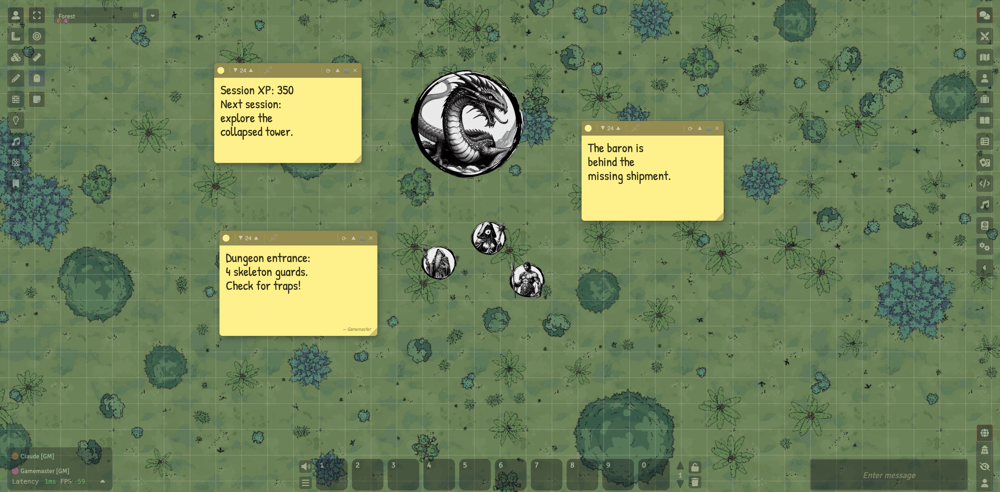
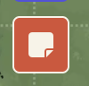
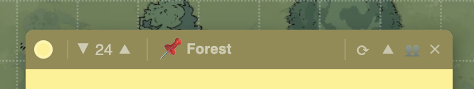
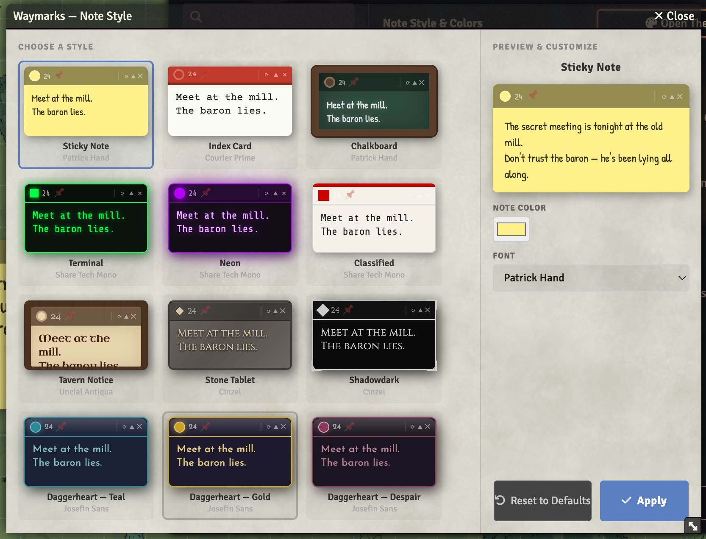
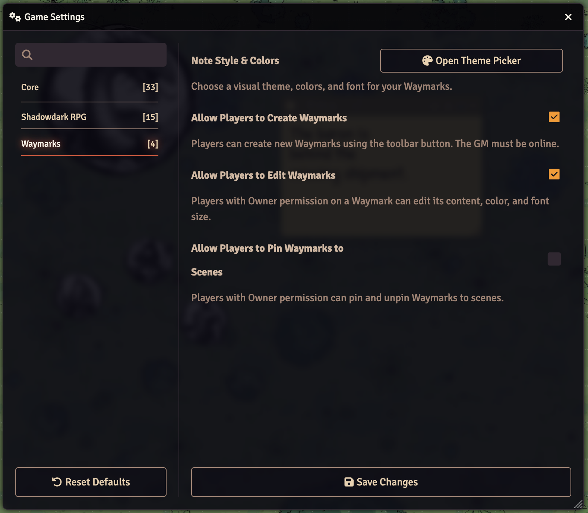
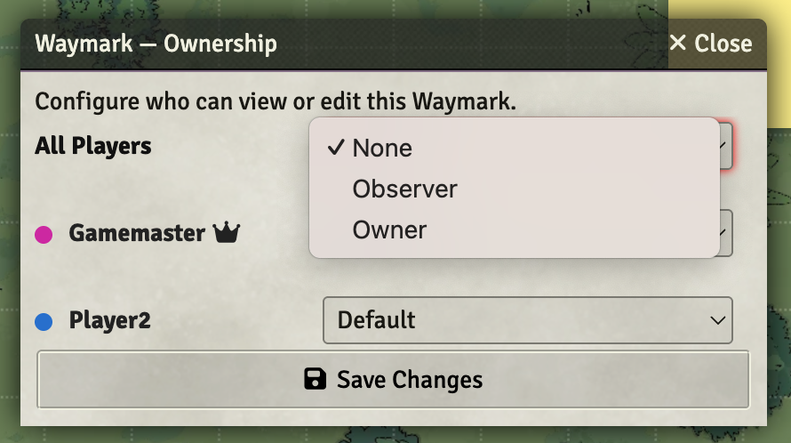

# Waymarks

**Quickly place persistent notes anywhere on your scenes.**

Waymarks lets Game Masters (and optionally players) pin resizable notes directly to the canvas — no sidebar digging, no journal fumbling. Notes persist between sessions, support 12 visual themes, and come with full per-note player permissions.



---

## Features

| Feature | Details |
|---|---|
| **12 Themes** | Sticky Note, Index Card, Chalkboard, Terminal, Neon, Classified, Tavern Notice, Stone Tablet, Shadowdark, Daggerheart Teal/Gold/Despair |
| **Resizable notes** | Drag the bottom-right handle to any size |
| **Scene pinning** | Pin a note to a scene so it only appears there, or leave it universal |
| **Player permissions** | Per-note: None / Can View / Can Edit — set per player |
| **Player note creation** | Optional: let players create their own Waymarks (GM online required) |
| **Author badge** | Notes from other users show a subtle `— Name` signature |
| **Send to GM** | Players can send their private note to the GM |
| **Collapsible** | Collapse any note to its header bar to save screen space |
| **Persistent layout** | Position and size saved per-client in localStorage |
| **Macro API** | Full JS API for macros and module integration |

---

## Installation

### Foundry Package Manager (recommended)
Search for **Waymarks** in the Add-on Modules browser, or paste the manifest URL directly:

```
https://github.com/MrJamela/waymarks/releases/latest/download/module.json
```

### Manual
1. Download the [latest release](https://github.com/MrJamela/waymarks/releases/latest)
2. Extract into your Foundry `Data/modules/` folder
3. Enable the module in your world's Manage Modules screen

**Requires:** [socketlib](https://github.com/manuelVo/foundryvtt-socketlib) ≥ 1.0.0

---

## Usage

### Creating a note
Click the **sticky note icon** in the left scene controls toolbar (bottom of the tools group).



A new note appears at the centre of your view. Click and drag the header to move it, drag the bottom-right corner to resize.

### Note controls



| Button | Action |
|---|---|
| ● Colour dot | Change note colour |
| ▼ 24 ▲ | Decrease / increase font size |
| 📌 Pin | Pin note to current scene (or unpin to make universal) |
| ↻ Theme | Open the Theme Picker |
| ▲ Collapse | Collapse note to header bar |
| 👥 Permissions | Open ownership dialog (GM only) |
| ✕ Delete | Permanently delete (GM) or dismiss for session (player) |

### Choosing a theme

Click the **↻ theme icon** on any note to open the Theme Picker. Choose from 12 themes — each shows a live preview. Adjust colours and font, then hit **Apply**.



The selected theme applies globally to all Waymarks in your world.

---

## Player Permissions

GMs can control what players can do via **Module Settings → Waymarks**:



| Setting | Effect |
|---|---|
| **Allow Players to Create Waymarks** | Players see the toolbar button and can create notes (relayed via the GM client) |
| **Allow Players to Edit Waymarks** | Players with Owner access can edit content, colour, and font size |
| **Allow Players to Pin Waymarks to Scenes** | Players with Owner access can pin/unpin their notes |

### Per-note access control

Click the **👥 button** on any note to open the ownership dialog:



Set each user to **None**, **Can View**, or **Can Edit**. Changes apply immediately to all connected clients.

---

## Keyboard Shortcut & Macros

**Keyboard shortcut:** `Shift+W` creates a new Waymark at the centre of your current view.

**Module API** — accessible from macros as `game.modules.get("waymarks").api`:

```js
const api = game.modules.get("waymarks").api;

// Create a note
await api.createNote({ x: 400, y: 300, content: "Meet at the mill." });

// Update a note's content
await api.updateNote("noteId", { content: "Updated!" });

// Delete a note
await api.deleteNote("noteId");

// Open the permissions dialog
api.openPermissions("noteId");

// Refresh all notes on screen
api.refresh();

// Get all currently visible notes
const notes = api.getNotes();
```

---

## Compatibility

| Foundry Version | Status |
|---|---|
| v13 | ✅ Verified |
| v12 | ❌ Not supported |

---

## Roadmap

- [ ] Per-note theme override
- [ ] Note title field
- [ ] Snap to grid
- [ ] Minimize all button
- [ ] Player dismiss persists across reloads

---

## Credits

Created by **MrJamela**  
Developed with AI assistance from [Claude](https://claude.ai) (Anthropic)  
Requires [socketlib](https://github.com/manuelVo/foundryvtt-socketlib) by manuelVo

---

## License

[MIT](LICENSE) © 2026 Jaime Matthew
